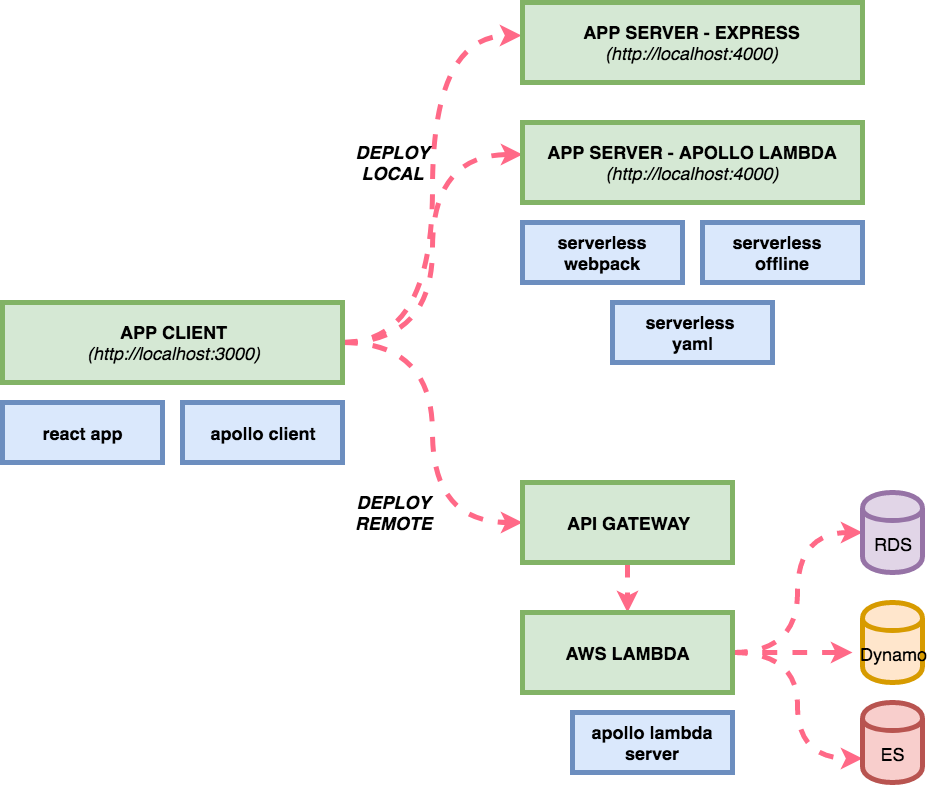

# Serverless GraphQL

This starter kit is an opinionated set of tools combined to help you get started building a Serverless application with an GraphQL endpoint and deploy them to production in minutes.

This example uses the following technologies:

- Serverless
- Apollo Lambda Server
- Apollo Client
- React
- Serverless Webpack
- Serverless Offline
- AWS Lambda
- AWS API Gateway
- Jest

## Architecture





## Install & Run

You need to have node 6 or higher installed.

```
npm install -g serverless
npm install -g yarn
yarn # installs all the node_modules
```

Use mocked data (keep in mind due hard-coded data the interface might behave not as expected)
```
npm start
# visit http://localhost:3000 in your browser
```

Use live data from the development environment. You need to make sure you have access to your deployed lambda functions. This works only after you deployed it to production.

```
npm run start:remote
# visit http://localhost:3000 in your browser
```

## Setup for Production

AWS has global unique bucket names. You need to replace `<your-s3-bucket-name>` in package.json as well as in the serverless.yml with your own custom name.

Since the URL of the API is unknown until you create a stack, you need to deploy once without expecting the application to work using `npm run deploy`. After the initial deploy you can see the API url which you need to provide to the URL entry in `security.env.prod`.


After these steps you are good to go and with your next `npm run deploy` your infrastructure should up and running. Visit `http://<your-s3-bucket-name>.s3-website-us-east-1.amazonaws.com` in your browser.

## Developing

If you make changes to the GraphQL schema stop the server, regenerate it and restart the server:

```
npm start
```

## Testing

We use Jest as a test runner. To run all tests use

```
npm run test
```

To update component snapshots after updating a component use

```
npm run test:update
```

## Security

At Serverless we keep our keys encrypted in the repository. We recommend you to do the same. In our case deploying to a staging and production system is done via a continuous integration system which has the secret to decrypt the necessary file with the environment variables. For demo purposes this repository has an unencrypted file for environment variables at `foundation/environment/security.env.local` and `foundation/environment/security.env.prod`.

## Multiple package.json

In order to keep the total amount of code uploaded to AWS Lambda small the `api` directory containing the Serverless service has it's own `package.json`. This speeds up uploading and also should reduce the cold start time of Lambda functions. You don't have to run `npm install` manually at any point. It will only happen during deploy, but you need make sure every library you are consuming in your GraphQL endpoint is added as a dependency there.

### `package.json`

- dependencies: dependencies used by the front-end
- devDependencies: dependencies used to package the front-end application & running the local environment

### `api/package.json`

- dependencies: dependencies used on AWS Lambda
